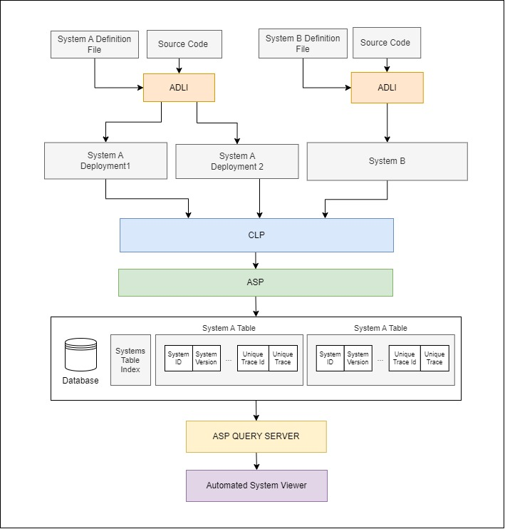

# Automated System Viewer (ASV)
This tool enables automatic visualization of system level traces as part of the Automated System Processor (ASP) framework.

# Developing
After cloning the repo, to install the necessary libraries, use the following command:
```shell
npm i
  ```

To start a development server, run the following command:
```shell
npm start
```

To build the application, run the following command:
```shell
npm run build
```
# Websocket Server
To start the websocket server that ASV connects to, please clone this [repo][asp-repo].  

After cloning the repo, navigate to components/asp and run the system processor to generate the ASP database using the following command:
```shell
python3 SystemProcessor.py
```
This will process all the log files in the system logs folder and it will save the extracted traces to the ASP database.

To start the websocket server that ASV connects to, navigate to components/query_handler and run the following command:
```shell
python3 server.py
```
This will start a websocket server on port 8765 (ASV connects to this port).

# How does it work? 

Unlike the Diagnostic Log Viewer, ASV primarily visualizes information that has already been processed by the Automated System Processor. For this reason, ASV does not implement logic to process systems, instead, it implements logic to visualize the system level traces. 



To make this possiblem, ASV does the following:
- It connects to ASP's websocket server to query the ASP database.
- It creates a structure to load each system in the database along with its metadata (such as version, programs, deployments).
- It provides a user interface for selecting a system with a specified version and a specified deployment.
- It queries the database for all the traces that belong to this deployment.
- It provides a user interface to select system level traces.
- It visualizes the system level trace in the canvas using React Flow.
- It visualizes the input/output variables in the system level trace.
- It visualizes the input/output variables for the selected node in the system level trace.
- It provides a user interface to filter through the traces with key values extracted from the trace input. 

# Providing feedback

You can use GitHub issues to [report a bug][bug-report] or [request a feature][feature-req].

[demo-url]: https://vishalpalaniappan.github.io/automated-system-viewer/
[asp-repo]: https://github.com/vishalpalaniappan/asp.git
[bug-report]: https://github.com/vishalpalaniappan/automated-system-viewer/issues
[feature-req]: https://github.com/vishalpalaniappan/automated-system-viewer/issues
